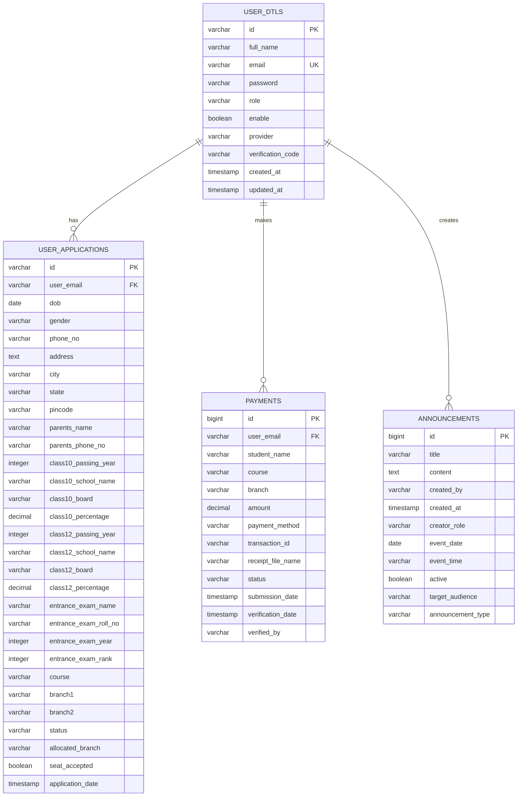

# 🗄️ College Admission Portal - Database Documentation

<div align="center">
  <h2>📊 Complete Database Schema & Management Guide</h2>
  <p>Comprehensive documentation for database setup, schema, queries, and maintenance</p>
</div>

---

## 📋 **Database Overview**

### **Database Information**
- **Database Name**: `college_portal_db`
- **Database Engine**: PostgreSQL 13+
- **Character Set**: UTF-8
- **Collation**: en_US.UTF-8
- **Connection Pool**: HikariCP
- **ORM**: Hibernate/JPA

### **Database User**
- **Username**: `college_user`
- **Privileges**: Full access to `college_portal_db`
- **Connection Limit**: 20 concurrent connections

---

## 🏗️ **Database Schema**

### **Table Structure Overview**



---

## 📊 **Detailed Table Schemas**

### **1. USER_DTLS Table**
```sql
CREATE TABLE user_dtls (
    id VARCHAR(255) PRIMARY KEY,
    full_name VARCHAR(255) NOT NULL,
    email VARCHAR(255) UNIQUE NOT NULL,
    password VARCHAR(255) NOT NULL,
    role VARCHAR(50) NOT NULL DEFAULT 'ROLE_USER',
    enable BOOLEAN DEFAULT FALSE,
    provider VARCHAR(50) DEFAULT 'local',
    verification_code VARCHAR(255),
    created_at TIMESTAMP DEFAULT CURRENT_TIMESTAMP,
    updated_at TIMESTAMP DEFAULT CURRENT_TIMESTAMP
);

-- Indexes for performance
CREATE INDEX idx_user_email ON user_dtls(email);
CREATE INDEX idx_user_role ON user_dtls(role);
CREATE INDEX idx_user_provider ON user_dtls(provider);
CREATE INDEX idx_user_enable ON user_dtls(enable);
CREATE INDEX idx_user_verification_code ON user_dtls(verification_code);

-- Comments
COMMENT ON TABLE user_dtls IS 'Main user table storing authentication and profile information';
COMMENT ON COLUMN user_dtls.id IS 'Unique user identifier generated using RandomString utility';
COMMENT ON COLUMN user_dtls.email IS 'User email address, used for login and communication';
COMMENT ON COLUMN user_dtls.password IS 'BCrypt hashed password for local authentication';
COMMENT ON COLUMN user_dtls.role IS 'User role: ROLE_ADMIN, ROLE_TEACHER, or ROLE_USER';
COMMENT ON COLUMN user_dtls.enable IS 'Account status: true for active, false for disabled/unverified';
COMMENT ON COLUMN user_dtls.provider IS 'Authentication provider: local, google, or github';
COMMENT ON COLUMN user_dtls.verification_code IS 'Email verification token or OAuth verification status';
```

### **2. USER_APPLICATIONS Table**
```sql
CREATE TABLE user_applications (
    id VARCHAR(255) PRIMARY KEY,
    user_email VARCHAR(255) NOT NULL,
    
    -- Personal Information
    dob DATE,
    gender VARCHAR(10),
    phone_no VARCHAR(15),
    address TEXT,
    city VARCHAR(100),
    state VARCHAR(100),
    pincode VARCHAR(10),
    
    -- Parent Information
    parents_name VARCHAR(255),
    parents_phone_no VARCHAR(15),
    
    -- Class 10 Academic Information
    class10_passing_year INTEGER,
    class10_school_name VARCHAR(255),
    class10_board VARCHAR(100),
    class10_percentage DECIMAL(5,2),
    
    -- Class 12 Academic Information
    class12_passing_year INTEGER,
    class12_school_name VARCHAR(255),
    class12_board VARCHAR(100),
    class12_percentage DECIMAL(5,2),
    
    -- Entrance Exam Information
    entrance_exam_name VARCHAR(100),
    entrance_exam_roll_no VARCHAR(50),
    entrance_exam_year INTEGER,
    entrance_exam_rank INTEGER,
    
    -- Course Preferences
    course VARCHAR(100),
    branch1 VARCHAR(100),
    branch2 VARCHAR(100),
    
    -- Application Status
    status VARCHAR(50) DEFAULT 'PENDING',
    allocated_branch VARCHAR(100),
    seat_accepted BOOLEAN DEFAULT FALSE,
    application_date TIMESTAMP DEFAULT CURRENT_TIMESTAMP,
    
    -- Foreign Key Constraint
    CONSTRAINT fk_application_user FOREIGN KEY (user_email) REFERENCES user_dtls(email) ON DELETE CASCADE
);

-- Indexes for performance
CREATE INDEX idx_application_user_email ON user_applications(user_email);
CREATE INDEX idx_application_status ON user_applications(status);
CREATE INDEX idx_application_course ON user_applications(course);
CREATE INDEX idx_application_branch1 ON user_applications(branch1);
CREATE INDEX idx_application_date ON user_applications(application_date);
CREATE INDEX idx_application_allocated_branch ON user_applications(allocated_branch);

-- Check constraints for data validation
ALTER TABLE user_applications ADD CONSTRAINT chk_gender CHECK (gender IN ('Male', 'Female', 'Other'));
ALTER TABLE user_applications ADD CONSTRAINT chk_class10_percentage CHECK (class10_percentage >= 0 AND class10_percentage <= 100);
ALTER TABLE user_applications ADD CONSTRAINT chk_class12_percentage CHECK (class12_percentage >= 0 AND class12_percentage <= 100);
ALTER TABLE user_applications ADD CONSTRAINT chk_status CHECK (status IN ('PENDING', 'UNDER_REVIEW', 'ADMITTED', 'REJECTED'));

-- Comments
COMMENT ON TABLE user_applications IS 'Student admission applications with academic and personal details';
COMMENT ON COLUMN user_applications.status IS 'Application status: PENDING, UNDER_REVIEW, ADMITTED, REJECTED';
COMMENT ON COLUMN user_applications.seat_accepted IS 'Whether student accepted the allocated seat';
```

### **3. PAYMENTS Table**
```sql
CREATE TABLE payments (
    id BIGSERIAL PRIMARY KEY,
    user_email VARCHAR(255) NOT NULL,
    student_name VARCHAR(255),
    course VARCHAR(100),
    branch VARCHAR(100),
    amount DECIMAL(10,2) NOT NULL,
    payment_method VARCHAR(50),
    transaction_id VARCHAR(100),
    receipt_file_name VARCHAR(255),
    status VARCHAR(20) DEFAULT 'PENDING',
    submission_date TIMESTAMP DEFAULT CURRENT_TIMESTAMP,
    verification_date TIMESTAMP,
    verified_by VARCHAR(255),
    
    -- Foreign Key Constraint
    CONSTRAINT fk_payment_user FOREIGN KEY (user_email) REFERENCES user_dtls(email) ON DELETE CASCADE
);

-- Indexes for performance
CREATE INDEX idx_payment_user_email ON payments(user_email);
CREATE INDEX idx_payment_status ON payments(status);
CREATE INDEX idx_payment_method ON payments(payment_method);
CREATE INDEX idx_payment_submission_date ON payments(submission_date);
CREATE INDEX idx_payment_transaction_id ON payments(transaction_id);

-- Check constraints
ALTER TABLE payments ADD CONSTRAINT chk_amount CHECK (amount > 0);
ALTER TABLE payments ADD CONSTRAINT chk_payment_status CHECK (status IN ('PENDING', 'VERIFIED', 'REJECTED'));
ALTER TABLE payments ADD CONSTRAINT chk_payment_method CHECK (payment_method IN ('bank_transfer', 'upi', 'card', 'cash'));

-- Comments
COMMENT ON TABLE payments IS 'Student fee payments with verification status';
COMMENT ON COLUMN payments.status IS 'Payment status: PENDING, VERIFIED, REJECTED';
COMMENT ON COLUMN payments.verified_by IS 'Email of admin/teacher who verified the payment';
```

### **4. ANNOUNCEMENTS Table**
```sql
CREATE TABLE announcements (
    id BIGSERIAL PRIMARY KEY,
    title VARCHAR(255) NOT NULL,
    content TEXT NOT NULL,
    created_by VARCHAR(255),
    created_at TIMESTAMP DEFAULT CURRENT_TIMESTAMP,
    creator_role VARCHAR(50),
    event_date DATE,
    event_time VARCHAR(10),
    active BOOLEAN DEFAULT TRUE,
    target_audience VARCHAR(50) DEFAULT 'ALL',
    announcement_type VARCHAR(50) DEFAULT 'GENERAL'
);

-- Indexes for performance
CREATE INDEX idx_announcement_active ON announcements(active);
CREATE INDEX idx_announcement_target_audience ON announcements(target_audience);
CREATE INDEX idx_announcement_type ON announcements(announcement_type);
CREATE INDEX idx_announcement_created_at ON announcements(created_at);
CREATE INDEX idx_announcement_event_date ON announcements(event_date);

-- Check constraints
ALTER TABLE announcements ADD CONSTRAINT chk_target_audience CHECK (target_audience IN ('ALL', 'STUDENTS', 'TEACHERS', 'PROSPECTIVE', 'ADMITTED'));
ALTER TABLE announcements ADD CONSTRAINT chk_announcement_type CHECK (announcement_type IN ('GENERAL', 'ADMISSION', 'EXAM', 'PAYMENT', 'EVENT'));

-- Comments
COMMENT ON TABLE announcements IS 'System announcements and notifications';
COMMENT ON COLUMN announcements.target_audience IS 'Target audience: ALL, STUDENTS, TEACHERS, PROSPECTIVE, ADMITTED';
COMMENT ON COLUMN announcements.announcement_type IS 'Type: GENERAL, ADMISSION, EXAM, PAYMENT, EVENT';
```

---

## 🔧 **Database Setup Scripts**

### **Initial Database Setup**
```sql
-- Create database and user
CREATE DATABASE college_portal_db
    WITH OWNER = postgres
    ENCODING = 'UTF8'
    LC_COLLATE = 'en_US.UTF-8'
    LC_CTYPE = 'en_US.UTF-8'
    TABLESPACE = pg_default
    CONNECTION LIMIT = -1;

-- Create application user
CREATE USER college_user WITH
    LOGIN
    NOSUPERUSER
    NOCREATEDB
    NOCREATEROLE
    INHERIT
    NOREPLICATION
    CONNECTION LIMIT -1
    PASSWORD 'your_secure_password';

-- Grant privileges
GRANT ALL PRIVILEGES ON DATABASE college_portal_db TO college_user;

-- Connect to the database
\c college_portal_db;

-- Grant schema privileges
GRANT ALL ON SCHEMA public TO college_user;
GRANT ALL PRIVILEGES ON ALL TABLES IN SCHEMA public TO college_user;
GRANT ALL PRIVILEGES ON ALL SEQUENCES IN SCHEMA public TO college_user;

-- Set default privileges for future objects
ALTER DEFAULT PRIVILEGES IN SCHEMA public GRANT ALL ON TABLES TO college_user;
ALTER DEFAULT PRIVILEGES IN SCHEMA public GRANT ALL ON SEQUENCES TO college_user;
```

### **Sample Data Insertion**
```sql
-- Insert sample admin user
INSERT INTO user_dtls (id, full_name, email, password, role, enable, provider, verification_code)
VALUES (
    'ADMIN_001',
    'System Administrator',
    'admin@collegeportal.com',
    '$2a$10$bP4zWBsRfxyot/1vD8Ez3.hDJKlh/sEmKu2/jXCw3MgD1UDQ3PyYm', -- BCrypt hashed password
    'ROLE_ADMIN',
    true,
    'local',
    'ADMIN_VERIFIED'
);

-- Insert sample teacher user
INSERT INTO user_dtls (id, full_name, email, password, role, enable, provider, verification_code)
VALUES (
    'TEACHER_001',
    'Dr. John Smith',
    'teacher@collegeportal.com',
    '$2a$10$bP4zWBsRfxyot/1vD8Ez3.hDJKlh/sEmKu2/jXCw3MgD1UDQ3PyYm', -- BCrypt hashed password
    'ROLE_TEACHER',
    true,
    'local',
    'TEACHER_VERIFIED'
);

-- Insert sample student user
INSERT INTO user_dtls (id, full_name, email, password, role, enable, provider, verification_code)
VALUES (
    'STUDENT_001',
    'Alice Johnson',
    'student@collegeportal.com',
    '$2a$10$bP4zWBsRfxyot/1vD8Ez3.hDJKlh/sEmKu2/jXCw3MgD1UDQ3PyYm', -- BCrypt hashed password
    'ROLE_USER',
    true,
    'local',
    'STUDENT_VERIFIED'
);

-- Insert sample application
INSERT INTO user_applications (
    id, user_email, dob, gender, phone_no, address, city, state, pincode,
    parents_name, parents_phone_no,
    class10_passing_year, class10_school_name, class10_board, class10_percentage,
    class12_passing_year, class12_school_name, class12_board, class12_percentage,
    entrance_exam_name, entrance_exam_roll_no, entrance_exam_year, entrance_exam_rank,
    course, branch1, branch2, status
) VALUES (
    'APP_001',
    'student@collegeportal.com',
    '2003-05-15',
    'Female',
    '9876543210',
    '123 Main Street, Downtown',
    'Mumbai',
    'Maharashtra',
    '400001',
    'Robert Johnson',
    '9876543211',
    2019,
    'ABC High School',
    'CBSE',
    95.50,
    2021,
    'XYZ Senior Secondary',
    'CBSE',
    92.75,
    'JEE Main',
    'JEE2021123456',
    2021,
    1250,
    'B.Tech',
    'Computer Science',
    'Electronics',
    'ADMITTED'
);

-- Insert sample payment
INSERT INTO payments (
    user_email, student_name, course, branch, amount, payment_method,
    transaction_id, status, verified_by
) VALUES (
    'student@collegeportal.com',
    'Alice Johnson',
    'B.Tech',
    'Computer Science',
    150000.00,
    'bank_transfer',
    'TXN123456789',
    'VERIFIED',
    'teacher@collegeportal.com'
);

-- Insert sample announcements
INSERT INTO announcements (title, content, created_by, creator_role, target_audience, announcement_type)
VALUES 
(
    'Welcome to Admission Portal',
    'Welcome to our College Admission Portal. Please complete your application before the deadline.',
    'admin@collegeportal.com',
    'ROLE_ADMIN',
    'ALL',
    'GENERAL'
),
(
    'Application Deadline Extended',
    'The application deadline has been extended to March 31, 2025. Don''t miss this opportunity!',
    'admin@collegeportal.com',
    'ROLE_ADMIN',
    'PROSPECTIVE',
    'ADMISSION'
),
(
    'Fee Payment Reminder',
    'Students who have been admitted, please complete your fee payment by April 15, 2025.',
    'teacher@collegeportal.com',
    'ROLE_TEACHER',
    'ADMITTED',
    'PAYMENT'
);
```

---

## 📈 **Database Performance Optimization**

### **Indexing Strategy**
```sql
-- Primary indexes (automatically created)
-- user_dtls: PRIMARY KEY (id)
-- user_applications: PRIMARY KEY (id)
-- payments: PRIMARY KEY (id)
-- announcements: PRIMARY KEY (id)

-- Foreign key indexes
CREATE INDEX CONCURRENTLY idx_application_user_email ON user_applications(user_email);
CREATE INDEX CONCURRENTLY idx_payment_user_email ON payments(user_email);

-- Query optimization indexes
CREATE INDEX CONCURRENTLY idx_user_email_enable ON user_dtls(email, enable);
CREATE INDEX CONCURRENTLY idx_application_status_course ON user_applications(status, course);
CREATE INDEX CONCURRENTLY idx_payment_status_date ON payments(status, submission_date);
CREATE INDEX CONCURRENTLY idx_announcement_active_audience ON announcements(active, target_audience);

-- Partial indexes for common queries
CREATE INDEX CONCURRENTLY idx_active_users ON user_dtls(email) WHERE enable = true;
CREATE INDEX CONCURRENTLY idx_pending_applications ON user_applications(user_email) WHERE status = 'PENDING';
CREATE INDEX CONCURRENTLY idx_pending_payments ON payments(user_email) WHERE status = 'PENDING';
CREATE INDEX CONCURRENTLY idx_active_announcements ON announcements(created_at) WHERE active = true;

-- Composite indexes for complex queries
CREATE INDEX CONCURRENTLY idx_user_role_provider ON user_dtls(role, provider);
CREATE INDEX CONCURRENTLY idx_application_course_branch ON user_applications(course, branch1);
CREATE INDEX CONCURRENTLY idx_payment_method_status ON payments(payment_method, status);
```

### **Query Performance Analysis**
```sql
-- Enable query statistics
CREATE EXTENSION IF NOT EXISTS pg_stat_statements;

-- Analyze slow queries
SELECT query, mean_time, calls, total_time, rows, 100.0 * shared_blks_hit / nullif(shared_blks_hit + shared_blks_read, 0) AS hit_percent
FROM pg_stat_statements 
ORDER BY mean_time DESC 
LIMIT 10;

-- Check index usage
SELECT schemaname, tablename, attname, n_distinct, correlation
FROM pg_stats
WHERE schemaname = 'public'
ORDER BY n_distinct DESC;

-- Table size analysis
SELECT 
    schemaname,
    tablename,
    pg_size_pretty(pg_total_relation_size(schemaname||'.'||tablename)) as size,
    pg_total_relation_size(schemaname||'.'||tablename) as size_bytes
FROM pg_tables 
WHERE schemaname = 'public'
ORDER BY size_bytes DESC;
```

---

## 🔍 **Common Database Queries**

### **User Management Queries**
```sql
-- Get all users with their roles
SELECT id, full_name, email, role, enable, provider, created_at
FROM user_dtls
ORDER BY created_at DESC;

-- Get users by role
SELECT full_name, email, enable
FROM user_dtls
WHERE role = 'ROLE_USER'
AND enable = true;

-- Get OAuth users
SELECT full_name, email, provider, verification_code
FROM user_dtls
WHERE provider != 'local';

-- User registration statistics
SELECT 
    provider,
    COUNT(*) as user_count,
    COUNT(CASE WHEN enable = true THEN 1 END) as active_users
FROM user_dtls
GROUP BY provider;
```

### **Application Management Queries**
```sql
-- Get all applications with user details
SELECT 
    a.id,
    u.full_name,
    u.email,
    a.course,
    a.branch1,
    a.status,
    a.application_date
FROM user_applications a
JOIN user_dtls u ON a.user_email = u.email
ORDER BY a.application_date DESC;

-- Get applications by status
SELECT 
    u.full_name,
    a.course,
    a.branch1,
    a.class12_percentage,
    a.entrance_exam_rank
FROM user_applications a
JOIN user_dtls u ON a.user_email = u.email
WHERE a.status = 'PENDING'
ORDER BY a.entrance_exam_rank ASC;

-- Course-wise application statistics
SELECT 
    course,
    COUNT(*) as total_applications,
    COUNT(CASE WHEN status = 'ADMITTED' THEN 1 END) as admitted,
    COUNT(CASE WHEN status = 'PENDING' THEN 1 END) as pending
FROM user_applications
GROUP BY course;

-- Merit list query
SELECT 
    u.full_name,
    a.course,
    a.branch1,
    a.class12_percentage,
    a.entrance_exam_rank,
    RANK() OVER (PARTITION BY a.course, a.branch1 ORDER BY a.entrance_exam_rank ASC) as merit_rank
FROM user_applications a
JOIN user_dtls u ON a.user_email = u.email
WHERE a.status IN ('PENDING', 'ADMITTED')
ORDER BY a.course, a.branch1, merit_rank;
```

### **Payment Management Queries**
```sql
-- Get all payments with user details
SELECT 
    p.id,
    u.full_name,
    p.course,
    p.branch,
    p.amount,
    p.payment_method,
    p.status,
    p.submission_date
FROM payments p
JOIN user_dtls u ON p.user_email = u.email
ORDER BY p.submission_date DESC;

-- Payment statistics
SELECT 
    status,
    COUNT(*) as payment_count,
    SUM(amount) as total_amount
FROM payments
GROUP BY status;

-- Revenue by course
SELECT 
    course,
    COUNT(*) as payments,
    SUM(amount) as revenue
FROM payments
WHERE status = 'VERIFIED'
GROUP BY course
ORDER BY revenue DESC;

-- Pending payments requiring verification
SELECT 
    p.id,
    u.full_name,
    p.amount,
    p.payment_method,
    p.transaction_id,
    p.submission_date
FROM payments p
JOIN user_dtls u ON p.user_email = u.email
WHERE p.status = 'PENDING'
ORDER BY p.submission_date ASC;
```

### **Announcement Queries**
```sql
-- Get active announcements
SELECT title, content, created_by, created_at, target_audience, announcement_type
FROM announcements
WHERE active = true
ORDER BY created_at DESC;

-- Get announcements by audience
SELECT title, content, event_date, event_time
FROM announcements
WHERE active = true
AND target_audience IN ('ALL', 'STUDENTS')
ORDER BY created_at DESC;

-- Announcement statistics
SELECT 
    announcement_type,
    COUNT(*) as count,
    COUNT(CASE WHEN active = true THEN 1 END) as active_count
FROM announcements
GROUP BY announcement_type;
```

---

## 🔄 **Database Maintenance**

### **Backup Procedures**
```bash
# Full database backup
pg_dump -h localhost -U college_user -d college_portal_db > backup_$(date +%Y%m%d_%H%M%S).sql

# Compressed backup
pg_dump -h localhost -U college_user -d college_portal_db | gzip > backup_$(date +%Y%m%d_%H%M%S).sql.gz

# Schema-only backup
pg_dump -h localhost -U college_user -d college_portal_db --schema-only > schema_backup.sql

# Data-only backup
pg_dump -h localhost -U college_user -d college_portal_db --data-only > data_backup.sql

# Specific table backup
pg_dump -h localhost -U college_user -d college_portal_db -t user_dtls > user_dtls_backup.sql
```

### **Restore Procedures**
```bash
# Restore full database
psql -h localhost -U college_user -d college_portal_db < backup_20250204_120000.sql

# Restore from compressed backup
gunzip -c backup_20250204_120000.sql.gz | psql -h localhost -U college_user -d college_portal_db

# Restore specific table
psql -h localhost -U college_user -d college_portal_db < user_dtls_backup.sql
```

### **Database Maintenance Tasks**
```sql
-- Update table statistics
ANALYZE;

-- Vacuum tables to reclaim space
VACUUM;

-- Full vacuum with analyze
VACUUM ANALYZE;

-- Reindex tables
REINDEX DATABASE college_portal_db;

-- Check for unused indexes
SELECT schemaname, tablename, indexname, idx_scan
FROM pg_stat_user_indexes
WHERE idx_scan = 0
AND schemaname = 'public';

-- Check table bloat
SELECT 
    schemaname, 
    tablename, 
    n_dead_tup, 
    n_live_tup,
    ROUND(n_dead_tup * 100.0 / (n_live_tup + n_dead_tup), 2) AS dead_percentage
FROM pg_stat_user_tables
WHERE n_dead_tup > 0
ORDER BY dead_percentage DESC;
```

### **Monitoring Queries**
```sql
-- Active connections
SELECT count(*) as active_connections
FROM pg_stat_activity
WHERE state = 'active';

-- Long running queries
SELECT pid, now() - pg_stat_activity.query_start AS duration, query
FROM pg_stat_activity
WHERE (now() - pg_stat_activity.query_start) > interval '5 minutes'
AND state = 'active';

-- Database size
SELECT pg_size_pretty(pg_database_size('college_portal_db')) as database_size;

-- Table sizes
SELECT 
    schemaname,
    tablename,
    pg_size_pretty(pg_total_relation_size(schemaname||'.'||tablename)) as size
FROM pg_tables
WHERE schemaname = 'public'
ORDER BY pg_total_relation_size(schemaname||'.'||tablename) DESC;

-- Index usage statistics
SELECT 
    schemaname,
    tablename,
    indexname,
    idx_scan,
    idx_tup_read,
    idx_tup_fetch
FROM pg_stat_user_indexes
WHERE schemaname = 'public'
ORDER BY idx_scan DESC;
```

---

## 🔒 **Database Security**

### **Security Best Practices**
```sql
-- Create read-only user for reporting
CREATE USER college_readonly WITH
    LOGIN
    NOSUPERUSER
    NOCREATEDB
    NOCREATEROLE
    INHERIT
    NOREPLICATION
    CONNECTION LIMIT 5
    PASSWORD 'readonly_password';

-- Grant read-only access
GRANT CONNECT ON DATABASE college_portal_db TO college_readonly;
GRANT USAGE ON SCHEMA public TO college_readonly;
GRANT SELECT ON ALL TABLES IN SCHEMA public TO college_readonly;

-- Row Level Security (RLS) for user data
ALTER TABLE user_applications ENABLE ROW LEVEL SECURITY;

-- Policy for users to see only their own applications
CREATE POLICY user_applications_policy ON user_applications
    FOR ALL TO college_user
    USING (user_email = current_setting('app.current_user_email'));

-- Audit table for tracking changes
CREATE TABLE audit_log (
    id BIGSERIAL PRIMARY KEY,
    table_name VARCHAR(50),
    operation VARCHAR(10),
    old_values JSONB,
    new_values JSONB,
    user_email VARCHAR(255),
    timestamp TIMESTAMP DEFAULT CURRENT_TIMESTAMP
);

-- Audit trigger function
CREATE OR REPLACE FUNCTION audit_trigger_function()
RETURNS TRIGGER AS $$
BEGIN
    IF TG_OP = 'DELETE' THEN
        INSERT INTO audit_log (table_name, operation, old_values, user_email)
        VALUES (TG_TABLE_NAME, TG_OP, row_to_json(OLD), current_setting('app.current_user_email', true));
        RETURN OLD;
    ELSIF TG_OP = 'UPDATE' THEN
        INSERT INTO audit_log (table_name, operation, old_values, new_values, user_email)
        VALUES (TG_TABLE_NAME, TG_OP, row_to_json(OLD), row_to_json(NEW), current_setting('app.current_user_email', true));
        RETURN NEW;
    ELSIF TG_OP = 'INSERT' THEN
        INSERT INTO audit_log (table_name, operation, new_values, user_email)
        VALUES (TG_TABLE_NAME, TG_OP, row_to_json(NEW), current_setting('app.current_user_email', true));
        RETURN NEW;
    END IF;
    RETURN NULL;
END;
$$ LANGUAGE plpgsql;

-- Apply audit triggers to sensitive tables
CREATE TRIGGER user_dtls_audit_trigger
    AFTER INSERT OR UPDATE OR DELETE ON user_dtls
    FOR EACH ROW EXECUTE FUNCTION audit_trigger_function();

CREATE TRIGGER payments_audit_trigger
    AFTER INSERT OR UPDATE OR DELETE ON payments
    FOR EACH ROW EXECUTE FUNCTION audit_trigger_function();
```

### **Data Encryption**
```sql
-- Enable pgcrypto extension for encryption
CREATE EXTENSION IF NOT EXISTS pgcrypto;

-- Example of encrypting sensitive data
-- (Note: This is handled at application level in our implementation)
UPDATE user_dtls 
SET password = crypt(password, gen_salt('bf', 10))
WHERE provider = 'local';
```

---

## 📊 **Database Reporting Queries**

### **Administrative Reports**
```sql
-- Daily registration report
SELECT 
    DATE(created_at) as registration_date,
    COUNT(*) as new_users,
    COUNT(CASE WHEN provider = 'local' THEN 1 END) as local_registrations,
    COUNT(CASE WHEN provider = 'google' THEN 1 END) as google_registrations,
    COUNT(CASE WHEN provider = 'github' THEN 1 END) as github_registrations
FROM user_dtls
WHERE created_at >= CURRENT_DATE - INTERVAL '30 days'
GROUP BY DATE(created_at)
ORDER BY registration_date DESC;

-- Application status summary
SELECT 
    status,
    COUNT(*) as count,
    ROUND(COUNT(*) * 100.0 / SUM(COUNT(*)) OVER (), 2) as percentage
FROM user_applications
GROUP BY status
ORDER BY count DESC;

-- Revenue report by month
SELECT 
    DATE_TRUNC('month', submission_date) as month,
    COUNT(*) as payment_count,
    SUM(amount) as total_revenue,
    AVG(amount) as average_payment
FROM payments
WHERE status = 'VERIFIED'
GROUP BY DATE_TRUNC('month', submission_date)
ORDER BY month DESC;

-- Course popularity report
SELECT 
    course,
    branch1,
    COUNT(*) as applications,
    AVG(class12_percentage) as avg_class12_percentage,
    AVG(entrance_exam_rank) as avg_entrance_rank
FROM user_applications
GROUP BY course, branch1
ORDER BY applications DESC;
```

### **Performance Reports**
```sql
-- Database performance summary
SELECT 
    'Total Users' as metric,
    COUNT(*)::text as value
FROM user_dtls
UNION ALL
SELECT 
    'Active Users',
    COUNT(*)::text
FROM user_dtls
WHERE enable = true
UNION ALL
SELECT 
    'Total Applications',
    COUNT(*)::text
FROM user_applications
UNION ALL
SELECT 
    'Total Payments',
    COUNT(*)::text
FROM payments
UNION ALL
SELECT 
    'Database Size',
    pg_size_pretty(pg_database_size('college_portal_db'))
FROM (SELECT 1) t;

-- Table growth analysis
SELECT 
    schemaname,
    tablename,
    n_tup_ins as inserts,
    n_tup_upd as updates,
    n_tup_del as deletes,
    n_live_tup as live_tuples,
    n_dead_tup as dead_tuples
FROM pg_stat_user_tables
WHERE schemaname = 'public'
ORDER BY n_live_tup DESC;
```

---

## 🚀 **Database Migration Scripts**

### **Version 1.0 to 1.1 Migration**
```sql
-- Add new columns for enhanced features
ALTER TABLE user_dtls ADD COLUMN last_login TIMESTAMP;
ALTER TABLE user_dtls ADD COLUMN login_attempts INTEGER DEFAULT 0;
ALTER TABLE user_dtls ADD COLUMN account_locked BOOLEAN DEFAULT FALSE;

-- Add indexes for new columns
CREATE INDEX idx_user_last_login ON user_dtls(last_login);
CREATE INDEX idx_user_account_locked ON user_dtls(account_locked);

-- Add new payment methods
ALTER TABLE payments DROP CONSTRAINT IF EXISTS chk_payment_method;
ALTER TABLE payments ADD CONSTRAINT chk_payment_method 
    CHECK (payment_method IN ('bank_transfer', 'upi', 'card', 'cash', 'net_banking', 'wallet'));

-- Add application tracking
ALTER TABLE user_applications ADD COLUMN last_updated TIMESTAMP DEFAULT CURRENT_TIMESTAMP;
ALTER TABLE user_applications ADD COLUMN updated_by VARCHAR(255);

-- Create trigger to update last_updated timestamp
CREATE OR REPLACE FUNCTION update_last_updated_column()
RETURNS TRIGGER AS $$
BEGIN
    NEW.last_updated = CURRENT_TIMESTAMP;
    RETURN NEW;
END;
$$ LANGUAGE plpgsql;

CREATE TRIGGER update_user_applications_last_updated
    BEFORE UPDATE ON user_applications
    FOR EACH ROW
    EXECUTE FUNCTION update_last_updated_column();
```

### **Data Migration Scripts**
```sql
-- Migrate existing data to new format
UPDATE user_dtls 
SET last_login = created_at 
WHERE last_login IS NULL;

-- Set default values for new columns
UPDATE user_applications 
SET last_updated = application_date 
WHERE last_updated IS NULL;

-- Clean up old verification codes
UPDATE user_dtls 
SET verification_code = 'MIGRATED_USER'
WHERE verification_code IS NULL 
AND enable = true;
```

---

## 📞 **Database Support & Troubleshooting**

### **Common Issues & Solutions**

#### **Connection Issues**
```sql
-- Check connection limits
SELECT count(*) as current_connections, setting as max_connections
FROM pg_stat_activity, pg_settings
WHERE name = 'max_connections';

-- Kill long-running connections
SELECT pg_terminate_backend(pid)
FROM pg_stat_activity
WHERE state = 'idle'
AND state_change < now() - interval '1 hour';
```

#### **Performance Issues**
```sql
-- Find slow queries
SELECT query, mean_time, calls
FROM pg_stat_statements
WHERE mean_time > 1000
ORDER BY mean_time DESC;

-- Check for missing indexes
SELECT schemaname, tablename, attname, n_distinct, correlation
FROM pg_stats
WHERE schemaname = 'public'
AND n_distinct > 100
AND correlation < 0.1;
```

#### **Space Issues**
```sql
-- Check database size
SELECT 
    datname,
    pg_size_pretty(pg_database_size(datname)) as size
FROM pg_database
ORDER BY pg_database_size(datname) DESC;

-- Find largest tables
SELECT 
    schemaname,
    tablename,
    pg_size_pretty(pg_total_relation_size(schemaname||'.'||tablename)) as size
FROM pg_tables
WHERE schemaname = 'public'
ORDER BY pg_total_relation_size(schemaname||'.'||tablename) DESC
LIMIT 10;
```

### **Emergency Procedures**
```bash
# Emergency backup
pg_dump -h localhost -U college_user -d college_portal_db --no-owner --no-privileges > emergency_backup_$(date +%Y%m%d_%H%M%S).sql

# Check database integrity
psql -h localhost -U college_user -d college_portal_db -c "SELECT pg_database_size('college_portal_db');"

# Restart PostgreSQL service (Ubuntu/Debian)
sudo systemctl restart postgresql

# Check PostgreSQL logs
sudo tail -f /var/log/postgresql/postgresql-13-main.log
```

---

## 📈 **Database Monitoring Dashboard**

### **Key Metrics to Monitor**
1. **Connection Count**: Current vs Maximum connections
2. **Query Performance**: Average response time, slow queries
3. **Database Size**: Total size, growth rate
4. **Table Statistics**: Row counts, index usage
5. **Lock Contention**: Blocking queries, deadlocks
6. **Backup Status**: Last backup time, backup size

### **Monitoring Queries**
```sql
-- Real-time monitoring view
CREATE VIEW db_monitoring AS
SELECT 
    'Active Connections' as metric,
    count(*)::text as value,
    'connections' as unit
FROM pg_stat_activity
WHERE state = 'active'
UNION ALL
SELECT 
    'Database Size',
    pg_size_pretty(pg_database_size('college_portal_db')),
    'bytes'
UNION ALL
SELECT 
    'Total Users',
    count(*)::text,
    'users'
FROM user_dtls
UNION ALL
SELECT 
    'Active Applications',
    count(*)::text,
    'applications'
FROM user_applications
WHERE status IN ('PENDING', 'UNDER_REVIEW');

-- Query to check monitoring view
SELECT * FROM db_monitoring;
```

---

**📅 Last Updated**: February 4, 2025  
**👨💻 Database Team**: College Technical Team  
**📧 Support**: database@collegeportal.com  
**🔧 Version**: PostgreSQL 13+ with College Portal Schema v1.1