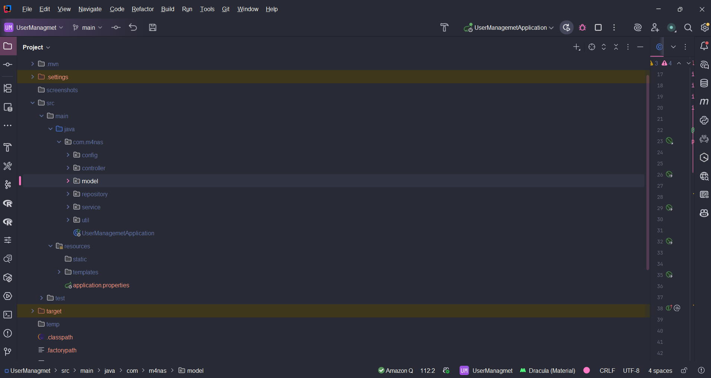
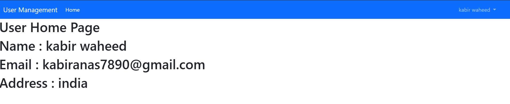
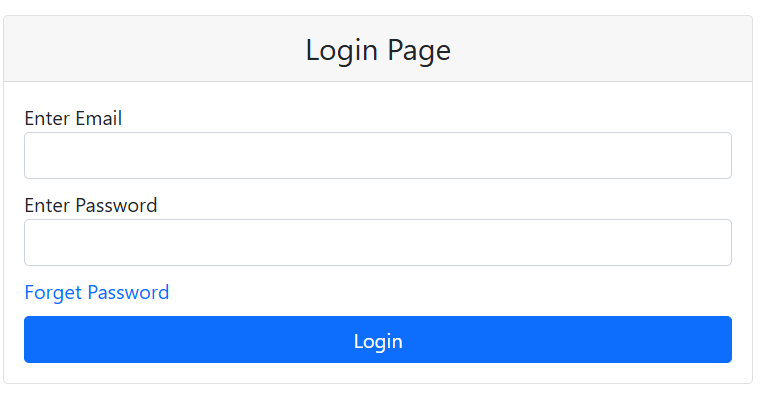
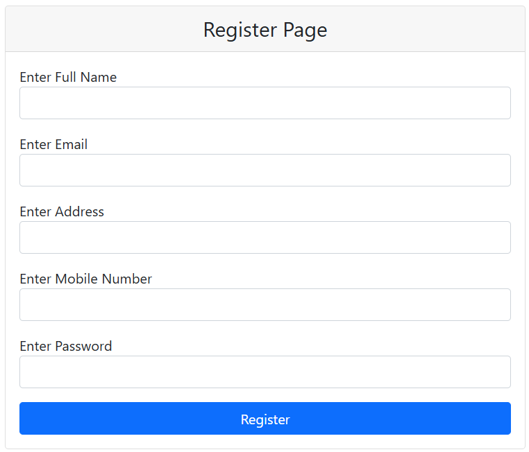
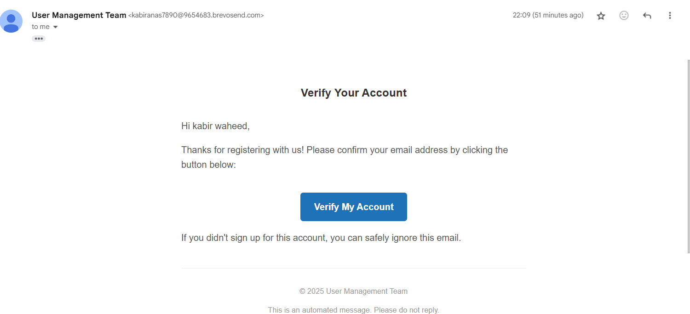
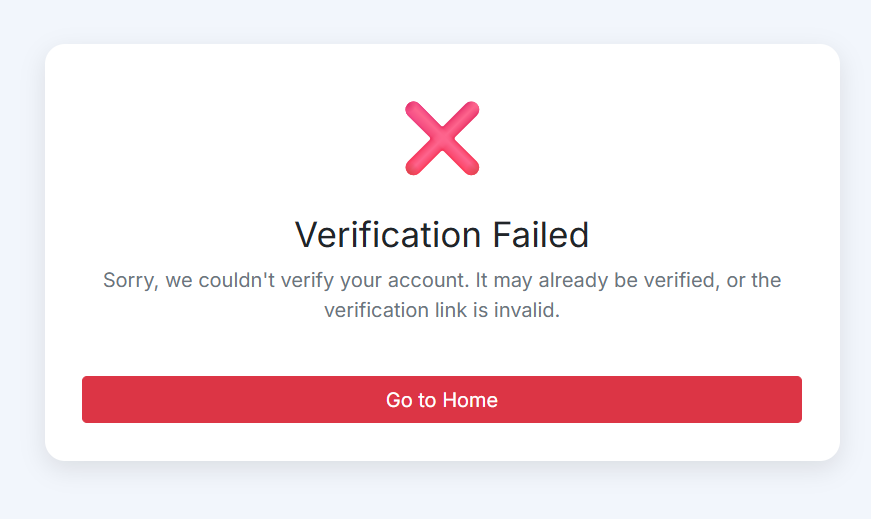
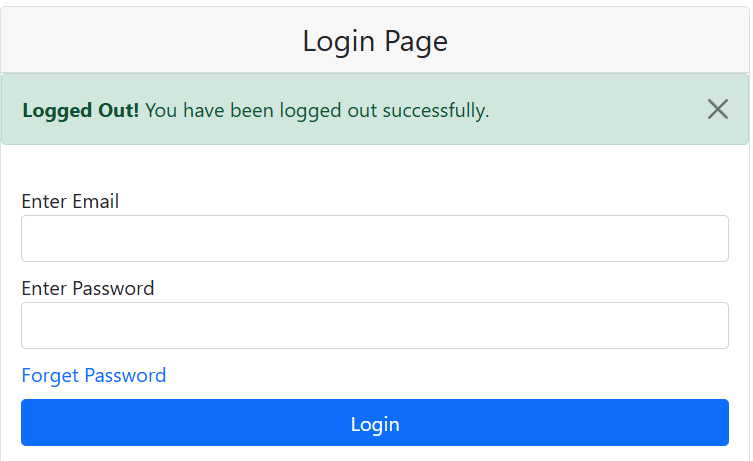
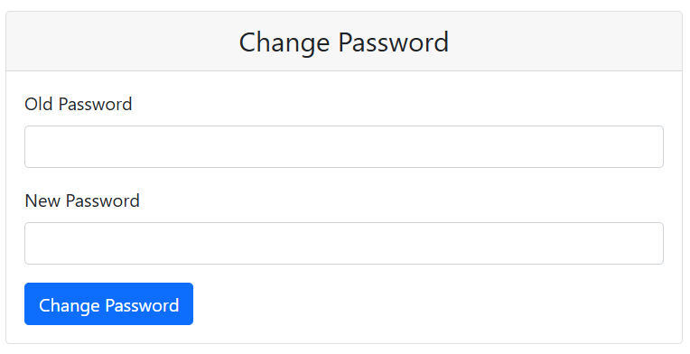

# User Management System - Spring Boot Application

A complete User Management System built using Spring Boot, Thymeleaf, and MySQL. This application supports user registration, login, logout, email verification, password encryption, and role-based access control.

---

## ✨ Features

- User registration with email verification (using Brevo)
- Login/logout functionality
- Password encryption with BCrypt
- Role-based access (USER / ADMIN)
- Spring Security Integration
- Forgot Password and Password Reset with Email OTP
- Database Integration (MySQL)
- Email verification using API key securely stored

---

## 📁 Project Structure

```bash
src/
├── main/
│   ├── java/
│   │   └── in/md4nas/usermanagement/
│   │       ├── config/
│   │       │   ├── CustomOAuth2User.java
│   │       │   ├── CustomOAuth2UserService.java
│   │       │   ├── CustomSuccessHandler.java
│   │       │   ├── CustomUserDetails.java
│   │       │   ├── OAuth2LoginSuccessHandler.java
│   │       │   ├── SecurityConfig.java
│   │       │   └── UserDetailsServiceImpl.java
│   │       ├── controller/
│   │       │   ├── AdminController.java
│   │       │   ├── HomeController.java
│   │       │   ├── TecherController.java  ← (typo? Should be `TeacherController`)
│   │       │   └── UserController.java
│   │       ├── model/
│   │       │   └── UserDtls.java
│   │       ├── repository/
│   │       │   └── UserRepository.java
│   │       ├── service/
│   │       │   ├── UserService.java
│   │       │   └── UserServiceImpl.java
│   │       └── util/
│   │           └── RandomString.java
│   │
│   │   └── UserManagementApplication.java
│
│   └── resources/
│       ├── static/
│       │   ├── css/
│       │   │   └── user-portal-style.css
│       │   └── js/
│       │       └── user-portal-script.js
│       ├── templates/
│       │   ├── admin/
│       │   │   └── home.html
│       │   ├── teacher/
│       │   │   └── home.html
│       │   └── user/
│       │       ├── settings/
│       │       │   └── home.html
│       │       ├── base.html
│       │       ├── forget_password.html
│       │       ├── index.html
│       │       ├── register.html
│       │       ├── reset_password.html
│       │       ├── signin.html
│       │       ├── verification-mail-template.html
│       │       ├── verify_failed.html
│       │       └── verify_success.html
│       └── application.properties
│
└── test/
    └── java/


---

## 🛠️ Setup Instructions

### Prerequisites

- Java 17+
- Maven
- MySQL
- IntelliJ IDEA

### Clone & Run

```bash
git clone https://github.com/your-username/user-management-system.git
cd user-management-system
```

1. Open the project in IntelliJ IDEA.
2. Create a `user_db` schema in MySQL.
3. Create a `application.properties` file in `src/main/resources/`:

```properties
spring.datasource.url=jdbc:mysql://localhost:3306/user_db
spring.datasource.username=your_username
spring.datasource.password=your_password

spring.jpa.hibernate.ddl-auto=update

spring.mail.host=smtp-relay.brevo.com
spring.mail.port=587
spring.mail.username=your_brevo_username
spring.mail.password=your_brevo_api_key
spring.mail.properties.mail.smtp.auth=true
spring.mail.properties.mail.smtp.starttls.enable=true
```

4. Run the application using the main method in `UserManagementApplication.java`.
5. Visit `http://localhost:8080` to get started.

---

## 🔐 Redirection Flow

| Action | URL | Description |
|-------|-----|-------------|
| Register | `/register` | User Registration Page |
| Verify Email | `/verify?code=` | Email verification link |
| Login | `/login` | User Login Page |
| Dashboard | `/home` | User Dashboard after login |
| Forgot Password | `/forgot-password` | Sends OTP |
| Reset Password | `/reset-password` | Enter new password |

---

## 📸 Screenshots

### 🔧 Project Structure


### 🏠 Home Page


### 🔐 Login Page


### ✍️ User Registration


### ✅ Email Verification


### ❌ Verification Failed


### 🔓 Logout


### 🔁 Change Password


---

## 📜 License

This project is licensed under the MIT License - see the [LICENSE](LICENSE) file for details.

---

## 🤝 Contribution

Feel free to fork this repo and submit PRs to improve it.

---

## 🙋‍♂️ Author

Developed by **Anas**  
GitHub: [md4nas](https://github.com/md4nas)

---

